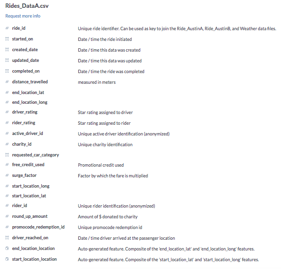
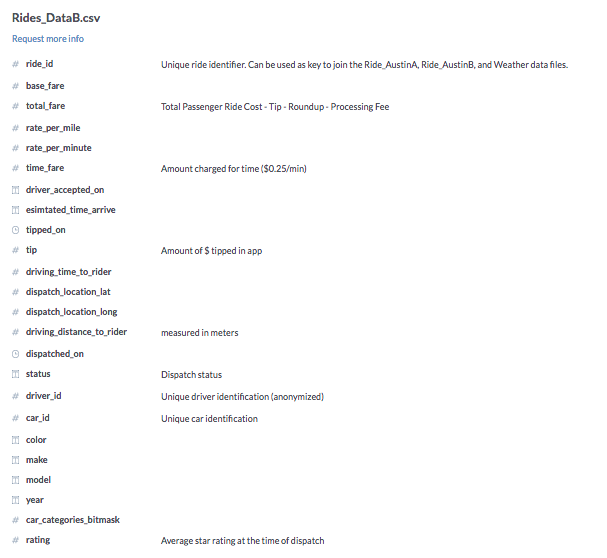

# RideAustin

This data project consists of 1,494,125 rides collected by RideAustin from July 2016 through April 2017. It drew my attention because ride shares are becoming an everyday part of our urban landscape. My interest in consumer behavior led me to explore patterns of demand and revenue.

I used Pandas library for data cleansing, and Seaborn and Matplotlib for data visualization. 

Data Part 1:
https://data.world/ride-austin/ride-austin-june-6-april-13

Data Part 2:
https://data.world/ride-austin/ride-austin-june-6-april-13-part-2

RideAustin Data Dictionary

